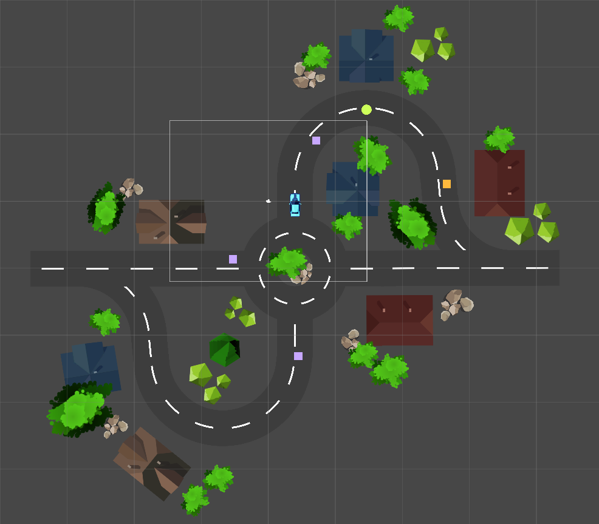

# Dilivery Driver
A practice project while learning Unity 2D. A game where the driver delivers all packages to the customer to win.

## Layout

Car: Player  
Purple squares: Packages to deliver  
Yellow square: Customer to receive the packages  
Green circle: Speed boost

## Commands
Move: Up / Down arrow keys  
Turn: Left / Right arrow keys

## Rules
The player needs to control the car to pick up all the packages and deliver to the customer.  
The car can only pick up one package at a time.  
If driving over a speed boost, the car will move faster.  
If bumped into an obstacle (e.g. houses, trees, rocks), the car will move slower.